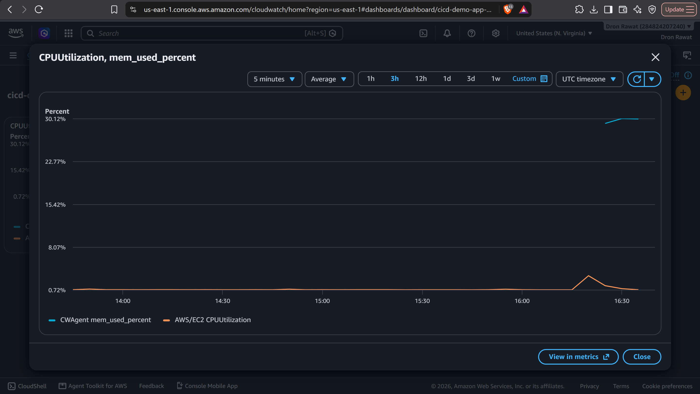

# CI/CD Pipeline with Kubernetes Deployment & AWS Monitoring

A Flask web application demonstrating a full, real-world DevOps workflow: automated CI/CD, container orchestration with Kubernetes, and cloud monitoring with AWS CloudWatch — all built and deployed hands-on, not just studied.

## What this project demonstrates

**1. Automated CI/CD Pipeline**
Push to `main` → GitHub Actions runs automated tests → builds a Docker image → pushes it to Docker Hub → deploys it to an AWS EC2 instance, with zero manual steps from commit to live server.

**2. Kubernetes Deployment & Self-Healing**
The same Docker image is deployed to a local Kubernetes cluster (via minikube) as a 2-replica Deployment with a NodePort Service for load-balanced access. Verified self-healing behavior firsthand: manually deleting a running pod, Kubernetes automatically detected the drop below the desired replica count and created a replacement within seconds — no manual intervention.

**3. Monitoring & Observability with AWS CloudWatch**
Installed and configured the CloudWatch Agent on the EC2 instance to collect memory and disk metrics (which AWS does not track by default — only the agent exposes these). Built a CloudWatch dashboard combining CPU utilization and memory usage on a single graph, giving real visibility into server health rather than flying blind.

## Architecture

```
GitHub Push
   │
   ▼
GitHub Actions ── test → build Docker image → push to Docker Hub
   │
   ▼
AWS EC2 (Ubuntu, Docker) ── live deployed app
   │                              │
   ▼                              ▼
CloudWatch Agent          Kubernetes (minikube)
(mem/disk metrics)         └─ Deployment (2 replicas)
   │                       └─ Service (NodePort)
   ▼                       └─ Self-healing verified
CloudWatch Dashboard
(CPU + Memory)
```

## Tech Stack
Python, Flask, Docker, GitHub Actions, AWS EC2, AWS IAM, Kubernetes (kubectl, minikube), AWS CloudWatch (Agent + Dashboards)

## Kubernetes manifests
See [`k8s/deployment.yaml`](./k8s/deployment.yaml) and [`k8s/service.yaml`](./k8s/service.yaml).

## Monitoring dashboard

*(CPU utilization and memory usage tracked together on one dashboard — memory required installing the CloudWatch Agent, since AWS doesn't expose it by default.)*

## Run locally
```bash
pip install -r requirements.txt
python app.py
```

## Run on Kubernetes locally (requires minikube + kubectl)
```bash
minikube start --driver=docker
kubectl apply -f k8s/deployment.yaml
kubectl apply -f k8s/service.yaml
kubectl get pods
minikube service cicd-demo-app-service
```

## What I learned
Real infrastructure work involves as much troubleshooting as building — this project's biggest lessons came from debugging real issues: a Docker Hub access token with insufficient write scope, an EC2 security group silently blocking GitHub Actions' IP range (a timeout, not a rejection — an important diagnostic distinction), IAM role permission boundaries between publishing and reading CloudWatch metrics, and Windows-specific path-quoting issues with SSH keys. Each of these mirrors the kind of real-world debugging expected in an actual DevOps/infrastructure role.
